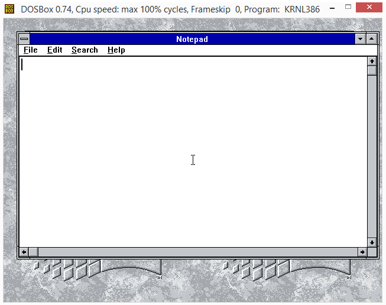

# osFree Janus Notepad

A minimalistic text editor faithfully recreating the classic Windows Notepad experience on 16-bit Windows 3.x.  
This is a downgraded version of the Wine Notepad application, adapted for the [osFree Win16 Personality](https://github.com/osfree-project/WIN16) project — an open-source implementation of the 16-bit Windows environment.

## 📖 About

This application brings the familiar Windows Notepad to Windows 3.0/3.1. It is derived from the source code of Wine’s Notepad, modified to compile and run correctly under the constraints of the 16-bit Windows API. The user interface, behaviour, and supported features are intentionally kept as close as possible to the original Notepad, offering a comfortable editing tool for plain text files.

The port removes dependencies on 32-bit Windows specifics and replaces them with equivalent Win16 APIs. It remains a clean, self-contained C89 program that can be built with OpenWatcom.

## ✨ Features

- **Basic text editing** – Open, edit, and save plain text files (`.txt`)
- **File management** – New, Open, Save, Save As
- **Clipboard support** – Cut, Copy, Paste, Delete, Select All
- **Word wrap** – Toggle between wrapped and unwrapped display mode
- **Find and replace** – Simple search dialog with exact text matching
- **Time/Date stamp** – Insert current system date and time at cursor position (`F5`)
- **Status bar** – Shows cursor position (line, column) when not in wrap mode (Windows 3.1 style)
- **Keyboard accelerators** – `Ctrl+N`, `Ctrl+O`, `Ctrl+S`, `Ctrl+C`, `Ctrl+X`, `Ctrl+V`, `F5`, etc.
- **About dialog** – Classic Help → About Notepad window
- **INI persistence** – Remembers window position, word-wrap setting, and other preferences in `WIN.INI`
- **Clean C89 code** – Strict ANSI C, compiled with OpenWatcom 1.9

## 🧩 Project Structure

| File | Description |
| :--- | :--- |
| `main.c` | Application entry point, window procedure, menu handling |
| `notepad.h` | Header file — constants, resource IDs, prototypes |
| `notepad.rc` | Resource file — menus, accelerators, dialog templates, version info |
| `makefile` | Build instructions for OpenWatcom Make |
| `notepad.ico` | Application icon |
| `shot.png` | Screenshot of the running application |
| `readme.md` | This documentation file |

## 🤝 Contributing

Contributions are welcome! Please follow these guidelines:

- **Bug reports** – Open issues in the [WIN16 repository Issues](https://github.com/osfree-project/WIN16/issues) or in the [Notepad repository](https://github.com/osfree-project/notepad/issues).
- **Pull requests** – Send your improvements and fixes via PR.
- **Code style** – The project uses C89; adhere to existing conventions.
- **Documentation** – Help improve this README and other project documents.

## 📜 License

The osFree Janus Notepad code is distributed under the **GNU Lesser General Public License (LGPL)**.  

## 🔗 Related Projects

- [osFree Win16 Personality (WIN16)](https://github.com/osfree-project/WIN16) – the main project to create an open-source clone of Windows 3.x
- [osFree Project](https://github.com/osfree-project) – the parent project for an open-source OS/2 clone
- [Control Panel](https://github.com/osfree-project/WIN16/tree/master/applications/control) – a clone of the Windows 3.x Control Panel
- [winver](https://github.com/osfree-project/winver) – a clone of the About dialog
- [Reversi](https://github.com/osfree-project/reversi) – a port of the OS/2 Othello game
- [Taskman](https://github.com/osfree-project/taskman) – a clone of Task Manager

## 👤 Copyright

- Original Wine Notepad — copyright by the Wine authors and contributors
- Win16 adaptation — (C) 2026 Yuri Prokushev and the [osFree](https://github.com/osfree-project) team

---

*Last updated: May 30, 2026*
